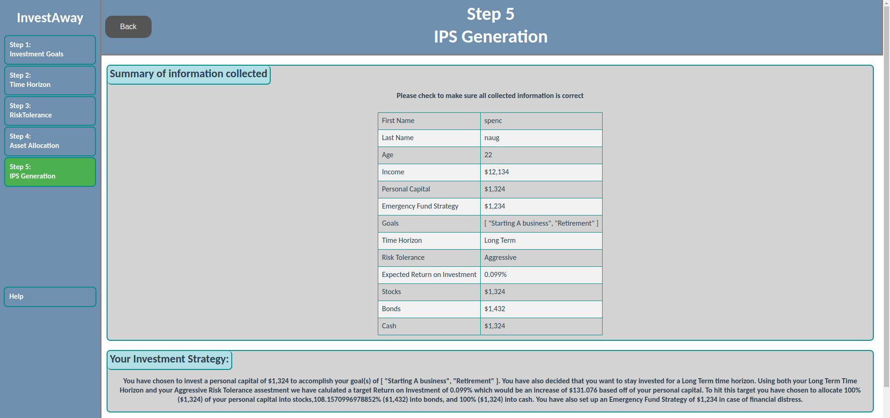

# How to use InvestAway

## Step 1 Investment Goals

You can type in your name and check whatever investment goals apply to you. You can also enter in a number for the personal capital which is how much moeny the user is investing. 

---

## Step 2: Time Horizon

The Time Horizon is how long the user plans on investing.
Answer the questions in this step to calculate your time horizon.
Time Horizon also directly affects the users Risk Tolerance in step 3

---

## Step 3: Risk Tolerance

Riskiness in investing is any uncertanty that has the potential to negatively impact your portfollio.
On this page we calculate the user's risk tolerance (how much risk the investor is willing to take on). by answering questions.

---

## Step 4: Asset Allocation

Asset Allocation is how the investor will split up their personal captial (stocks, bonds, or cash).
Once the information is set, a pie chart will be generated which shows the user's asset allocation in percentage. 

---

## Final Page

Once you reach this step you can see a convinient summary of the information the investor ented.

---

## IPS

Once the pdf is download you can open it by clicking on the download. The PDF is the paper copy of the Investment Policy Statement. It includes all of the information that was entered in the previous steps.

